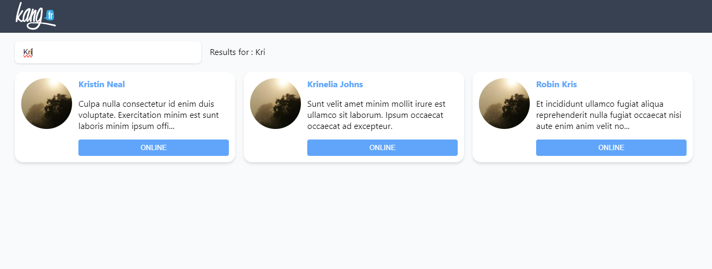

## VueJS & Tailwind

#### Project setup
```
npm install
```

#### Compiles and hot-reloads for development
```
npm run serve
```

## Project
The interest of the test is to use the basic concepts of VueJS and Tailwind.
Link of the documentations:

- https://v2.vuejs.org/
- https://v2.tailwindcss.com/

The purpose of the exercise is to load the list of offers from the **public/offers.json** file to display them as shown in the following screenshots:


**The development will be done in the components:**

1. **OfferList**: Use the **loadOffers()** method when loading the component to retrieve the offers and display them in a list format. Each item in the list is an **OfferCard** component.
    1. The list should display on **3 columns in desktop format**
    2. The list should display on **1 column in mobile format**
2. **OfferCard**: Format the component so that it appears as in the screenshots.
    1. The component takes an **offer** object as a parameter.
    2. Use a **computed property** to limit the description to a maximum of 100 characters.
3. **OfferButton**: Create a component that allows to call the offer by phone (in our case we will use a function already existing in the project).
    1. The button takes a parameter that defines if it is disabled.
    2. The button uses **in all cases** the CSS class: **.base-button**
    3. The disabled button uses **in addition** the CSS class: **.base-button-disabled**
    4. The **startCall()** function of the **OfferCard** component is called at the **click** of the button.
4. **BaseTextInput**: Use the **BaseTextInput** component to make a dynamic search engine in OfferList.
    1. The component is not complete, it needs to be modified so that it can transmit its value to the parent component.
    2. The ongoing search should be displayed next to the field in such a way “**Results for : {{ search }}**”
    3. The list of offers must be filtered as in the following screenshot:

